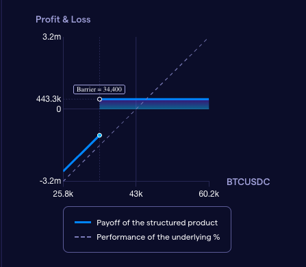

# Obligate Encode x Solana Hackathon Submission

## Try the demo **[here!](https://encode-solana-hackathon.obligate.com)**

## Background
The goal for this demo was to create a new way for issuers of structured products to issue
and manage their products on the Solana blockchain.
The product chosen for this demo is a **Barrier Reverse Convertible**,
a structured product that is popular in the traditional finance world.
BRC is an investment product with a high guaranteed coupon, 
and a variable repayment of the principal that depends on the performance of the underlying asset:
* If the final price of the underlying is above the barrier level, 100% of the initial investment is repaid back; 
* If it’s below, then repayment amount shall be recalculated as the performance of the underlying asset.

It allows investors to give up the potential upside exposure to the underlying asset in exchange for an enhanced coupon. 
The ideal market scenario for reverse convertibles is the expectation of a sideways trending market.

See the attached graph for a visual representation of the product.

In most of the markets, the product is issued by a financial institution on the request of an investor. 
The investor requests a product with certain parameters in mind. 
And potential issuers compete on the yield they can offer on the product.
Once the investor accepts an offer, the issuer will issue the product to the investor.

## Challenges with current solutions
Current solutions for issuing structured products are centralized and require a lot of 
intermediaries. This makes the process of issuing and managing structured products slow and cumbersome.

As an example the final fixing date, maturity and settlement of the product are 3-7 days apart from each other.
They also require a lot of manual intervention due to lack of automation
of price fixing and payment settlement.

Since Structured Products are considered to be securities in most jurisdictions, 
they required to be properly registered and stored in segregated accounts.

Intransparency of the Structured Products pricing might hurt market integrity and decreases overall investors' confidence.

## Challenges with pure blockchain solutions
Pure blockchain/DeFi solutions don't provide the legal certainty that is required for structured products.
Issuers and investors usually like to negotiate the terms of the product in private.
Holding a Structured Product creates risk exposure of the investor to both the Underlying Asset and the Issuer.
Hence pure DeFi solution with anonimous Issuers and therefore unknown credit risk shall be avoided by investors.

## Challenges with SPL Token before Token 2022
With the old Token program it was not easily possible to maintain snapshots of token account balances.
It was also not directly possible to have rules on token transfers, that depending on the issuer may require
tokens to stay within a whitelisted ecosystem.

Specifically the transfer hook in token 2022 is what was missing in the old token program to allow fully 
functional structured products to be issued on Solana.

## Solution
The solution we aim to demonstrate with this demo is a hybrid where the negotiation of the product
is done on a platform and legal certainty is provided Obligate's legal framework based the Swiss law for ledger-based securities.
(The demo does not include the complete legal framework, but it is a part of the Obligate platform.)

The issuer submits their offer which includes the **yield** and **initial fixing price**, 
as a Solana transaction signed offline. This transaction will only become valid if the investor
signs the transaction with their private key. 
This way the negotiation of the product is done in private.

The investor will accept the offer by signing and broadcasting the transaction to the Solana network.
The investor will pay for and receive the product issued by the issuer in an atomic transaction.

(On production there would be a third signature by Obligate signing off on the legality of the product.)

By automating all parts of the product lifecycle we are able to payout coupons, set the final fixing price 
and final principal and payout the principal to the investor without any manual intervention, as long as the
investor carries enough funds on a **Treasury wallet** on Solana.

# Technical implementation

There are five Solana programs in this repository that are used to issue and manage the structured product.

1. **Structured Product Program** - This program is used to initialize other programs, configure and manage payments and issue the structured product as an SPL token.
2. **Transfer Snapshot Hook** - This program is used to maintain snapshots of token account balances at payment dates.
3. **BRC Price Authority** - This program is used to set the final fixing price and final principal of the structured product. It is set as the price authority on the principal payment.
4. **Treasury Wallet** - This program allows the issuer to deposit funds into a treasury wallet which can automatically pay out coupons and principal to the investor given a signed authorization to the structured product program.
5. **Dummy Oracle** - This program is used to simulate an oracle that sets initial and final fixing price of the underlying asset.

## Structured Product Program
